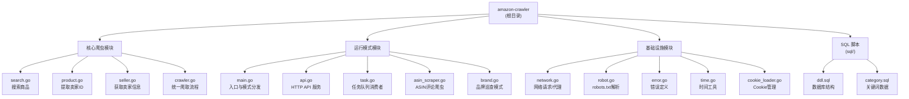

# amazon-crawler 项目架构文档

## 变更记录 (Changelog)

| 日期 | 版本 | 变更内容 |
|------|------|----------|
| 2025-12-28 | v1.0.0 | 初始化项目架构文档 |
| 2026-01-12 | v1.1.0 | 更新数据库表名和字段定义，与实际结构保持一致 |
| 2026-01-12 | v1.2.0 | 重构 Cookie 管理机制：支持动态分配、失效标记和自动切换 |
| 2026-01-23 | v1.3.0 | 新增多运行模式：HTTP API 服务、ASIN 评论爬虫、品牌巡查模式；新增内存优化爬取流程 |

---

## 项目愿景

amazon-crawler 是一个分布式亚马逊商品信息爬虫工具，支持多种运行模式：
- **命令行模式**：通过关键词/品牌名搜索商品，提取卖家信息（名称、地址、税号）
- **HTTP API 模式**：提供 RESTful API 接口，支持异步任务提交和状态查询
- **ASIN 评论爬虫模式**：批量获取指定 ASIN 的评分和评论数
- **品牌巡查模式**：批量巡查品牌列表，获取品牌对应的卖家信息

项目遵循 robots.txt 协议，支持多主机协同工作。

---

## 架构总览

### 技术栈
- **语言**: Go 1.19
- **数据库**: MySQL 5.7+ / 8.x+
- **HTML解析**: goquery
- **HTTP客户端**: net/http (支持 SOCKS5 代理)
- **配置**: YAML
- **日志**: go-log
- **构建**: goreleaser

### 架构特点
- **多运行模式**: 命令行 / HTTP API / ASIN爬虫 / 品牌巡查
- **三层处理流程**: 搜索商品 -> 提取卖家ID -> 获取卖家信息
- **分布式设计**: 通过 app_id 和 host_id 实现多主机协同
- **状态机管理**: 每个阶段都有独立的状态跟踪
- **robots.txt 遵守**: 内置 robots.txt 解析器
- **容错重试**: 支持 404/503 等错误的自动重试和 Cookie 自动切换
- **内存优化**: HTTP 模式支持内存传递，减少数据库 IO

---

## 模块结构图



---

## 模块索引

| 模块路径 | 职责描述 | 语言 | 状态 |
|----------|----------|------|------|
| `/` (根目录) | 核心爬虫逻辑，包含多种运行模式 | Go | 活跃 |
| `/sql` | 数据库表结构与初始化数据 | SQL | 活跃 |

### 核心文件说明

| 文件 | 职责 | 关键函数/结构体 |
|------|------|----------------|
| `main.go` | 程序入口、配置初始化、模式分发 | `main()`, `appConfig`, `init_*()` |
| `search.go` | 搜索商品页面，提取商品链接 | `searchStruct`, `get_product_url()` |
| `product.go` | 访问商品页，提取卖家ID和品牌名 | `productStruct`, `get_seller_id()` |
| `seller.go` | 访问卖家页，获取商家详细信息 | `sellerStruct`, `syncToAmazonShop()` |
| `crawler.go` | 统一爬取流程（内存优化版） | `ExecuteCrawl()`, `batchSaveAll()` |
| `api.go` | HTTP API 服务端点 | `StartHTTPServer()`, `handleCrawl()` |
| `task.go` | 异步任务队列消费者 | `TaskWorker`, `processPendingTasks()` |
| `asin_scraper.go` | ASIN 评论爬虫 | `ASINScraper`, `extractRating()` |
| `brand.go` | 品牌巡查模式 | `brandStruct`, `brandMain()` |
| `network.go` | HTTP 客户端、SOCKS5 代理 | `get_client()`, `get_socks5_proxy()` |
| `robot.go` | robots.txt 解析与检查 | `Robots`, `IsAllow()` |
| `cookie_loader.go` | Cookie 文件/数据库管理 | `CookieEntry`, `GetCookieStats()` |
| `error.go` | 自定义错误类型 | `ERROR_NOT_503`, `ERROR_VERIFICATION` |

---

## 运行模式

### 1. 命令行模式（默认）

传统的三阶段爬取流程，从数据库读取关键词，逐步处理。

```bash
./amazon-crawler -c config.yaml
```

### 2. HTTP API 服务模式

启动 HTTP 服务，通过 API 提交爬取任务。

```bash
./amazon-crawler -c config.yaml -serve :8080
```

**API 端点**:
| 方法 | 路径 | 说明 |
|------|------|------|
| POST | `/api/crawl` | 提交爬取任务（关键词列表） |
| GET | `/api/status` | 查看任务状态统计 |
| GET | `/health` | 健康检查 |

**请求示例**:
```bash
curl -X POST http://localhost:8080/api/crawl \
  -H "Content-Type: application/json" \
  -d '{"keywords": ["brand1", "brand2"]}'
```

### 3. ASIN 评论爬虫模式

批量获取指定 ASIN 的评分和评论数，输出 CSV 文件。

```bash
./amazon-crawler -c config.yaml -asin "B08N5WRWNW,B07XYZ" -domain "www.amazon.com.mx"
```

**输出**: `output/asins_YYYYMMDD_HHMMSS.csv`

### 4. 品牌巡查模式

批量巡查 `available_brand_domains` 表中的品牌，获取卖家信息并写入 `tb_amazon_shop`。

```bash
./amazon-crawler -c config.yaml -brand
```

**配置项** (config.yaml):
```yaml
brand:
  enable: true
  max_asins: 5    # 每品牌最多搜索的ASIN数
  batch: 100      # 每批处理数量
  loop: 0         # 循环次数，0=无限
```

---

## 运行与开发

### 环境要求
- Go 1.19+
- MySQL 5.7+ 或 8.x+

### 初始化步骤

1. **数据库初始化**

> **注意**: 数据库名称在 `config.yaml` 中配置（`mysql.database` 字段）。
> 所有表名均以 `amc_` 为前缀（Amazon Crawler 缩写）。

```bash
# 创建数据库并导入表结构
mysql -u root -p < sql/ddl.sql

# 导入关键词数据
mysql -D your_database -u root -p < sql/category.sql
```

2. **配置文件**
```bash
# 复制配置模板
cp config.yaml.example config.yaml

# 编辑配置文件
# - mysql: 数据库连接信息
# - basic.app_id: 同一主机下的程序标识
# - basic.host_id: 不同主机标识
# - basic.domain: 亚马逊域名
# - proxy: 代理配置（可选）
# - exec.enable: 启用哪些功能
# - brand: 品牌巡查配置
```

3. **Cookie 配置**

```sql
-- 插入新的未分配 Cookie（推荐）
INSERT INTO `amc_cookie` (`cookie`, `zipcode`, `city`, `status`)
VALUES ('session-id=xxx; session-token=xxx;', '10001', 'New York, NY', 1);

-- 查看 Cookie 统计
SELECT
    COUNT(*) as total,
    SUM(CASE WHEN status = 1 THEN 1 ELSE 0 END) as active,
    SUM(CASE WHEN status = 0 THEN 1 ELSE 0 END) as invalid,
    SUM(CASE WHEN status = 1 AND host_id IS NULL THEN 1 ELSE 0 END) as unassigned
FROM amc_cookie;
```

### 启动程序
```bash
# 编译
go build -o amazon-crawler

# 命令行模式
./amazon-crawler -c config.yaml

# HTTP 服务模式
./amazon-crawler -c config.yaml -serve :8080

# ASIN 爬虫模式
./amazon-crawler -c config.yaml -asin "B08N5WRWNW" -domain "www.amazon.com.mx"

# 品牌巡查模式
./amazon-crawler -c config.yaml -brand
```

---

## 核心流程

### 三阶段处理流程

```
1. 搜索阶段 (search.go)
   从 amc_category 表获取关键词
   -> 搜索亚马逊商品页面
   -> 提取商品链接、标题、价格、评分等
   -> 存入 amc_product 表

2. 产品阶段 (product.go)
   从 amc_product 表获取待处理商品
   -> 访问商品页面
   -> 提取卖家链接、seller ID、品牌名
   -> 存入 amc_seller 表

3. 卖家阶段 (seller.go)
   从 amc_seller 表获取待处理卖家
   -> 访问卖家页面
   -> 提取商家名称、地址、税号(TRN)、反馈数
   -> 更新 amc_seller 表
   -> 同步到 tb_amazon_shop 表
```

### 内存优化流程（HTTP 模式）

```
crawler.go: ExecuteCrawlWithStatus()
   |
   +-> crawlSearchInMemory()     # 搜索，返回内存列表
   |
   +-> crawlProductsFromMemory() # 提取卖家，内存去重
   |
   +-> fetchSellerDetails()      # 获取卖家详情
   |
   +-> batchSaveAll()            # 事务批量写入数据库
```

### 状态流转

#### amc_category 表 task_status
- 0: 待执行 (PENDING)
- 1: 已完成 (COMPLETED)
- 2: 失败 (FAILED)

#### amc_product 表 status
- 0: 未搜索
- 1: 准备检查
- 2: 检查结束
- 3: 其他错误
- 4: 没有商家
- 5: 从搜索页获取（暂不查询）

#### amc_seller 表 trn_status
- 0: TRN 未查找
- 1: 中国 TRN (18位，9开头)
- 2: 空 TRN
- 3: 其他 TRN
- 4: 异常 TRN

#### amc_seller 表 all_status
- 0: 未查找
- 1: 信息完整
- 2: 没有名称
- 3: 没有地址
- 4: 没有 TRN

#### 品牌巡查 patrol_status
- 0: 待巡查
- 1: 巡查中
- 2: 已完成
- 3: 失败
- 4: 无结果

---

## 数据模型

### 业务模式说明

> **重要变更**: 程序已从「关键词搜索」改为「品牌搜索」模式

品牌名是贯穿整个数据流的核心标识：

| 表名 | 字段名 | 说明 |
|------|--------|------|
| amc_category | en_key | 品牌名（原字段名为"英文关键词"） |
| amc_product | keyword | 品牌名（商品来源品牌） |
| tb_amazon_shop | domain | 品牌名（店铺所属品牌） |

### 核心表结构

#### amc_category - 搜索关键词/品牌表
```sql
id           int         主键，自增
zh_key       varchar(30) 中文关键词
en_key       varchar(50) 英文关键词/品牌名
priority     int         搜索优先级，默认 0
task_status  tinyint     任务状态: 0-待执行, 1-已完成, 2-失败
created_at   datetime    创建时间
updated_at   datetime    更新时间
索引: idx_task_status (task_status)
```

#### amc_product - 商品表
```sql
id             int           主键，自增
url            varchar(200)  商品URL（唯一索引）
param          varchar(1000) URL参数
title          varchar(500)  商品标题
asin           varchar(50)   亚马逊商品标识
keyword        varchar(100)  搜索关键词/品牌名
bought_count   varchar(50)   购买次数
price          varchar(50)   价格
rating         varchar(10)   评分
review_count   varchar(50)   评论数
seller_id      varchar(25)   卖家ID
brand_name     varchar(100)  品牌名称
brand_store_url varchar(500) 品牌店铺URL
status         tinyint       处理状态，默认 0
app            tinyint       所属应用ID
```

#### amc_seller - 卖家表
```sql
id           int          主键，自增
seller_id    varchar(25)  卖家ID（唯一索引）
name         varchar(200) 商家名称
seller_name  varchar(200) 卖家名称
keyword      varchar(100) 来源关键词/品牌名
address      varchar(200) 商家地址
trn          varchar(28)  税号
trn_status   tinyint      税号状态，默认 0
all_status   tinyint      信息状态，默认 0
app_id       tinyint      所属应用ID
company_id   char(16)     公司ID
fb_1month    int          1个月反馈数
fb_3month    int          3个月反馈数
fb_12month   int          12个月反馈数
fb_lifetime  int          总反馈数
```

#### amc_cookie - Cookie Session表
```sql
id          int         主键，自增
host_id     tinyint     主机ID，新创建时为空（NULL），分配后填入
cookie      text        Session Cookie内容（必填）
zipcode     varchar(10) 邮编（可选）
city        varchar(50) 城市（可选）
status      tinyint     状态: 1-正常, 0-已失效
created_at  datetime    创建时间
updated_at  datetime    更新时间
索引: idx_host_id (host_id), idx_status (status)
```

#### tb_amazon_shop - 亚马逊店铺表（外部同步）
```sql
id                      int          主键，自增
user_id                 int          用户ID（固定为1）
domain                  varchar      品牌名（核心关联字段）
shop_id                 varchar      店铺ID，即 seller_id
shop_name               varchar      店铺名称
shop_url                varchar      店铺URL
marketplace             varchar      市场（如 "US"）
company_name            varchar      公司名称
company_address         varchar      公司地址
fb_1month               int          1个月反馈数
fb_3month               int          3个月反馈数
fb_12month              int          12个月反馈数
fb_lifetime             int          总反馈数
crawl_time              datetime     爬取时间
create_time             datetime     创建时间
update_time             datetime     更新时间
唯一索引: (domain, shop_id)
```

### 表关联关系

```
┌─────────────────┐
│  amc_category   │ ─────────────────────────────────────┐
│   (品牌列表)     │                                      │
│  en_key=品牌名   │                                      │
└────────┬────────┘                                      │
         │ id                                            │
         │                                               │
         ▼ category_id                                   │ en_key -> keyword (品牌名)
┌─────────────────┐                              ┌───────▼─────────┐
│amc_search_stats │                              │   amc_product   │
│   (搜索统计)     │                              │     (商品)      │
└─────────────────┘                              │ keyword=品牌名   │
                                                 └────────┬────────┘
                                                          │ seller_id
                                                          │
                                                          ▼ seller_id
                                                 ┌─────────────────┐
                                                 │   amc_seller    │
                                                 │     (卖家)      │
                                                 └────────┬────────┘
                                                          │ 同步
                                                          ▼
                                                 ┌─────────────────┐
                                                 │ tb_amazon_shop  │
                                                 │  (外部店铺表)    │
                                                 │ domain=品牌名    │
                                                 │ shop_id=卖家ID   │
                                                 └─────────────────┘
```

---

## 测试策略

### 手动测试
1. 设置 `test: true` 启用测试模式（不连接数据库）
2. 单独启用各阶段测试：
   - 只启用 `enable.search`: 测试搜索
   - 只启用 `enable.product`: 测试商品处理
   - 只启用 `enable.seller`: 测试卖家信息获取

### 调试视图
```sql
-- 查看产品处理状态
SELECT * FROM 产品检查表;

-- 查看程序运行状态
SELECT * FROM 程序状态表;

-- 查看搜索统计
SELECT * FROM 搜索统计表;

-- 查看商家TRN统计
SELECT * FROM 商家trn表;
```

---

## 编码规范

### 代码组织
- 每个 `.go` 文件对应一个功能模块
- 使用结构体封装相关数据和操作
- 错误处理优先，错误日志使用 `log.Errorf`
- 状态更新使用独立的常量定义

### 命名约定
- 结构体: `camelCase` (如 `searchStruct`, `productStruct`)
- 常量: `UPPER_SNAKE_CASE` (如 `MYSQL_SEARCH_STATUS_START`)
- 函数: `snake_case` 或 `camelCase` (如 `get_category`, `search_start`)
- 全局变量: `camelCase` (如 `app`, `robot`, `taskWorker`)

### 错误处理
- 自定义错误定义在 `error.go`
- 使用 `is_duplicate_entry()` 检查重复插入错误
- 网络错误返回特定错误类型:
  - `ERROR_NOT_404`: 404 错误
  - `ERROR_NOT_503`: 503 错误
  - `ERROR_VERIFICATION`: 需要验证（Cookie 失效）
  - `ERROR_NOT_SELLER_URL`: 没有卖家链接

---

## AI 使用指引

### 上下文重点
1. **多运行模式**: 命令行 / HTTP API / ASIN爬虫 / 品牌巡查
2. **三阶段处理流程**: 搜索 -> 产品 -> 卖家，理解状态机的流转
3. **分布式设计**: app_id (同主机多程序) 和 host_id (多主机cookie)
4. **robots.txt 遵守**: 所有请求都需经过 `robot.IsAllow()` 检查
5. **Cookie 自动管理**: 失效自动标记，自动获取新 Cookie

### 常见任务
- 添加新的关键词/品牌: 操作 `amc_category` 表或调用 `/api/crawl` API
- 修改搜索优先级策略: 修改 `search.go` 中的 `get_category()`
- 添加新的卖家信息字段: 修改 `seller.go` 和数据库表结构
- 调整重试策略: 修改各阶段的错误处理逻辑
- 扩展 API 端点: 修改 `api.go`

### 关键文件关联
- `main.go`: 入口、配置初始化、模式分发
- `crawler.go`: 统一爬取流程（内存优化版）
- `search.go`: 商品搜索逻辑
- `product.go`: 卖家ID提取逻辑
- `seller.go`: 卖家信息获取逻辑
- `api.go`: HTTP API 服务
- `task.go`: 任务队列消费者
- `brand.go`: 品牌巡查模式
- `asin_scraper.go`: ASIN 评论爬虫
- `network.go`: HTTP 客户端、代理支持
- `robot.go`: robots.txt 解析
- `cookie_loader.go`: Cookie 管理工具
- `sql/ddl.sql`: 数据库表结构
- `config.yaml.example`: 配置模板

---

## 运行示例

### 单机运行
```yaml
basic:
  app_id: 1
  host_id: 1
  domain: "www.amazon.com"

exec:
  enable:
    search: true
    product: true
    seller: true
  loop:
    all: 0  # 无限循环
```

### 多机分布式运行
```
主机 A: app_id=1, host_id=1
主机 B: app_id=2, host_id=2
主机 C: app_id=3, host_id=2  # 相同 cookie
```

### HTTP API 服务
```bash
# 启动服务
./amazon-crawler -c config.yaml -serve :8080

# 提交任务
curl -X POST http://localhost:8080/api/crawl \
  -H "Content-Type: application/json" \
  -d '{"keywords": ["Nike", "Adidas"]}'

# 查看状态
curl http://localhost:8080/api/status
```

---

## 性能参考

根据项目 README 的实际运行数据：
- 4天时间
- 1k+ 关键词
- 两次搜索
- 发现 235,334 个产品
- 约 100,891 个产品完成卖家信息检查

---

## 许可证

本项目开源，请遵守相关法律法规和网站 robots.txt 规定。
