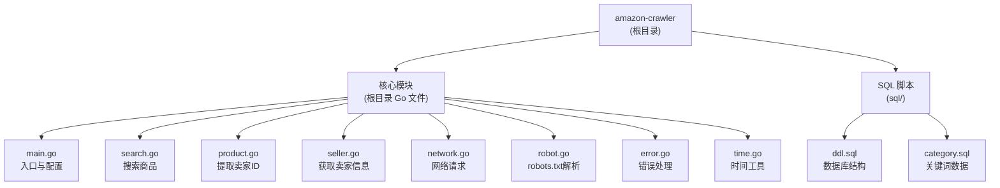

# amazon-crawler 项目架构文档

## 变更记录 (Changelog)

| 日期 | 版本 | 变更内容 |
|------|------|----------|
| 2025-12-28 | v1.0.0 | 初始化项目架构文档 |
| 2026-01-12 | v1.1.0 | 更新数据库表名和字段定义，与实际结构保持一致 |
| 2026-01-12 | v1.2.0 | 重构 Cookie 管理机制：支持动态分配、失效标记和自动切换 |

---

## 项目愿景

amazon-crawler 是一个分布式亚马逊商品信息爬虫工具，通过关键词搜索商品，提取卖家信息（名称、地址、税号），适用于多主机分布式运行场景。项目遵循 robots.txt 协议，支持多主机协同工作。

---

## 架构总览

### 技术栈
- **语言**: Go 1.19
- **数据库**: MySQL
- **HTML解析**: goquery
- **HTTP客户端**: net/http (支持 SOCKS5 代理)
- **配置**: YAML
- **日志**: go-log
- **构建**: goreleaser

### 架构特点
- **三层处理流程**: 搜索商品 -> 提取卖家ID -> 获取卖家信息
- **分布式设计**: 通过 app_id 和 host_id 实现多主机协同
- **状态机管理**: 每个阶段都有独立的状态跟踪
- **robots.txt 遵守**: 内置 robots.txt 解析器
- **容错重试**: 支持 404/503 等错误的自动重试

---

## 模块结构图



---

## 模块索引

| 模块路径 | 职责描述 | 语言 | 状态 |
|----------|----------|------|------|
| `/` (根目录) | 核心爬虫逻辑，包含搜索、提取、信息获取三个阶段 | Go | 活跃 |
| `/sql` | 数据库表结构与初始化数据 | SQL | 活跃 |

---

## 运行与开发

### 环境要求
- Go 1.19+
- MySQL 5.7+ 或 8.x+

### 初始化步骤

1. **数据库初始化**

> **注意**: 数据库名称在 `config.yaml` 中配置（`mysql.database` 字段），以下示例使用默认数据库名。
> 所有表名均以 `amc_` 为前缀（Amazon Crawler 缩写）。

```bash
# 创建数据库并导入表结构
bin/mysql -u root -p < sql/ddl.sql

# 导入关键词数据（根据配置的数据库名修改 -D 参数）
bin/mysql -D your_database -u root -p < sql/category.sql

# 创建数据库用户（根据实际数据库名修改）
# MySQL 5.7.x
GRANT ALL PRIVILEGES ON your_database.* to 'your_user'@'%' identified by 'password';
flush privileges;

# MySQL 8.x
create user 'your_user'@'%' identified by 'password';
GRANT ALL PRIVILEGES ON your_database.* TO 'your_user'@'%' WITH GRANT OPTION;
flush privileges;
```

2. **配置文件**
```bash
# 复制配置模板
cp config.yaml.save config.yaml

# 编辑配置文件
# - 设置 mysql 连接信息
# - 设置 basic.app_id (同一主机下的程序标识)
# - 设置 basic.host_id (不同主机标识)
# - 设置 basic.domain (亚马逊域名)
# - 配置 proxy (可选)
# - 配置 exec.enable (启用哪些功能)
# - 配置 exec.loop (循环次数)
```

3. **Cookie 配置**

> **新版本 Cookie 管理说明**：Cookie 现在支持动态分配和自动切换。
> 新获取的 Cookie 不需要指定 host_id，程序会自动分配。

```sql
-- 方式1: 插入新的未分配 Cookie（推荐，由程序自动分配 host_id）
INSERT INTO `amc_cookie` (`cookie`, `zipcode`, `city`, `status`)
VALUES ('session-id=xxx; session-token=xxx;', '10001', 'New York, NY', 1);

-- 方式2: 插入已绑定 host_id 的 Cookie（用于迁移或强制指定）
INSERT INTO `amc_cookie` (`host_id`, `cookie`, `status`)
VALUES (1, 'session-id=xxx; session-token=xxx;', 1);

-- 查看 Cookie 状态
SELECT id, host_id, status, zipcode, city,
       LEFT(cookie, 50) as cookie_preview,
       created_at, updated_at
FROM amc_cookie;

-- 查看 Cookie 统计
SELECT
    COUNT(*) as total,
    SUM(CASE WHEN status = 1 THEN 1 ELSE 0 END) as active,
    SUM(CASE WHEN status = 0 THEN 1 ELSE 0 END) as invalid,
    SUM(CASE WHEN status = 1 AND host_id IS NULL THEN 1 ELSE 0 END) as unassigned
FROM amc_cookie;
```

### 启动程序
```bash
# 编译
go build -o amazon-crawler

# 运行
./amazon-crawler -c config.yaml
```

### 开发构建
```bash
# 使用 goreleaser 构建
goreleaser build
```

---

## 核心流程

### 三阶段处理流程

```
1. 搜索阶段 (search.go)
   从 amc_category 表获取关键词
   -> 搜索亚马逊商品页面
   -> 提取商品链接
   -> 存入 amc_product 表

2. 产品阶段 (product.go)
   从 amc_product 表获取待处理商品
   -> 访问商品页面
   -> 提取卖家链接和 seller ID
   -> 存入 amc_seller 表

3. 卖家阶段 (seller.go)
   从 amc_seller 表获取待处理卖家
   -> 访问卖家页面
   -> 提取商家名称、地址、税号(TRN)
   -> 更新 amc_seller 表
```

### 状态流转

#### amc_application 表状态
- 0: 启动中
- 1: 结束
- 2: 搜索页面中
- 3: 查找商家中
- 4: 确定 TRN 中

#### amc_product 表状态
- 0: 未搜索
- 1: 准备检查
- 2: 检查结束
- 3: 其他错误
- 4: 没有商家

#### amc_seller 表 trn_status
- 0: TRN 未查找
- 1: 中国 TRN (18位，9开头)
- 2: 空 TRN
- 3: 其他 TRN
- 4: 异常 TRN

#### amc_seller 表 all_status
- 0: 未查找
- 1: 信息完整
- 2: 没有名称
- 3: 没有地址
- 4: 没有 TRN

---

## 数据模型

### 业务模式说明

> **重要变更**: 程序已从「关键词搜索」改为「品牌搜索」模式

原设计是通过关键词搜索商品，现改为通过品牌名搜索该品牌下的所有商品和卖家。

### 核心字段映射（品牌名）

品牌名是贯穿整个数据流的核心标识，在不同表中的字段名不同但值相同：

| 表名 | 字段名 | 说明 |
|------|--------|------|
| amc_category | en_key | 品牌名（原字段名为"英文关键词"） |
| amc_product | keyword | 品牌名（商品来源品牌） |
| tb_amazon_shop | domain | 品牌名（店铺所属品牌） |

```
数据流转：
amc_category.en_key ──搜索──> amc_product.keyword ──同步──> tb_amazon_shop.domain
      (品牌名)                    (品牌名)                      (品牌名)
```

### 核心表结构

> **注意**: 所有表名均以 `amc_` 为前缀（Amazon Crawler 缩写），`tb_amazon_shop` 为外部同步表

#### amc_category - 搜索关键词表
```sql
id           int         主键，自增
zh_key       varchar(30) 中文关键词
en_key       varchar(50) 英文关键词
priority     int         搜索优先级，默认 0
task_status  tinyint     任务状态，默认 0
created_at   datetime    创建时间
updated_at   datetime    更新时间
```

#### amc_product - 商品表
```sql
id             int           主键，自增
url            varchar(200)  商品URL（唯一索引）
param          varchar(1000) URL参数
title          varchar(500)  商品标题
asin           varchar(50)   亚马逊商品标识
keyword        varchar(100)  搜索关键词
bought_count   varchar(50)   购买次数
price          varchar(50)   价格
rating         varchar(10)   评分
review_count   varchar(50)   评论数
seller_id      varchar(25)   卖家ID
brand_name     varchar(100)  品牌名称
brand_store_url varchar(500) 品牌店铺URL
status         tinyint       处理状态，默认 0
app            tinyint       所属应用ID
```

#### amc_seller - 卖家表
```sql
id           int          主键，自增
seller_id    varchar(25)  卖家ID（唯一索引）
name         varchar(200) 商家名称
seller_name  varchar(200) 卖家名称
keyword      varchar(100) 来源关键词
address      varchar(200) 商家地址
trn          varchar(28)  税号
trn_status   tinyint      税号状态，默认 0
all_status   tinyint      信息状态，默认 0
app_id       tinyint      所属应用ID
company_id   char(16)     公司ID
fb_1month    int          1个月反馈数，默认 0
fb_3month    int          3个月反馈数，默认 0
fb_12month   int          12个月反馈数，默认 0
fb_lifetime  int          总反馈数，默认 0
```

#### amc_search_statistics - 搜索统计表
```sql
id          int      主键，自增
category_id int      关键词ID（索引）
start       datetime 开始时间
end         datetime 结束时间
status      tinyint  状态，默认 0
app         tinyint  应用ID
valid       int      有效商品数，默认 0
```

#### amc_application - 应用状态表
```sql
id      int      主键，自增
app_id  int      应用ID
status  tinyint  状态，默认 0
update  datetime 更新时间
```

#### amc_cookie - Cookie Session表
```sql
id          int         主键，自增
host_id     tinyint     主机ID，新创建时为空（NULL），分配后填入
cookie      text        Session Cookie内容（必填）
zipcode     varchar(10) 邮编（可选）
city        varchar(50) 城市（可选）
status      tinyint     状态: 1-正常, 0-已失效，默认 1
created_at  datetime    创建时间
updated_at  datetime    更新时间
索引: idx_host_id (host_id), idx_status (status)
```

**Cookie 管理流程**：
1. 通过 SKILL 获取新的 Session，保存时 `host_id` 为空，`status` 为 1（正常）
2. 主程序启动时，根据配置的 `host_id` 查找已绑定的正常 Cookie
3. 如果没有绑定的 Cookie，自动从未分配池（`host_id IS NULL AND status = 1`）中获取一个并绑定
4. 当 Cookie 失效（遇到验证页面 `ERROR_VERIFICATION`）时：
   - 将当前 Cookie 标记为失效（`status = 0`）
   - 自动从未分配池获取新的 Cookie 并绑定到当前 `host_id`
5. 如果没有可用的未分配 Cookie，程序会提示需要通过 SKILL 获取新的 Session

#### tb_amazon_shop - 亚马逊店铺表（外部同步）
```sql
id                      int          主键，自增
user_id                 int          用户ID（固定为1）
domain                  varchar      品牌名（核心关联字段）
shop_id                 varchar      店铺ID，即 seller_id（核心关联字段）
shop_name               varchar      店铺名称
shop_url                varchar      店铺URL
marketplace             varchar      市场（如 "US"）
company_name            varchar      公司名称
company_address         varchar      公司地址
fb_1month               int          1个月反馈数
fb_3month               int          3个月反馈数
fb_12month              int          12个月反馈数
fb_lifetime             int          总反馈数
main_products           varchar      主营产品
avg_price               decimal      平均价格
estimated_monthly_sales int          预估月销量
crawl_time              datetime     爬取时间
create_time             datetime     创建时间
update_time             datetime     更新时间
唯一索引: (domain, shop_id)
```

**数据写入来源**：
- `seller.go`: 卖家信息获取完成后同步，domain = seller.keyword（品牌名）
- `brand.go`: 品牌巡查获取店铺信息后，domain = brandName（品牌名）

### 表关联关系

```
┌─────────────────┐
│  amc_category   │ ─────────────────────────────────────┐
│   (品牌列表)     │                                      │
│  en_key=品牌名   │                                      │
└────────┬────────┘                                      │
         │ id                                            │
         │                                               │
         ▼ category_id                                   │ en_key → keyword (品牌名)
┌─────────────────┐                              ┌───────▼─────────┐
│amc_search_stats │                              │   amc_product   │
│   (搜索统计)     │                              │     (商品)      │
└─────────────────┘                              │ keyword=品牌名   │
                                                 └────────┬────────┘
                                                          │ seller_id
                                                          │
                                                          ▼ seller_id
                                                 ┌─────────────────┐
                                                 │   amc_seller    │
                                                 │     (卖家)      │
                                                 └────────┬────────┘
                                                          │ 同步
                                                          ▼
                                                 ┌─────────────────┐
                                                 │ tb_amazon_shop  │
                                                 │  (外部店铺表)    │
                                                 │ domain=品牌名    │
                                                 │ shop_id=卖家ID   │
                                                 └─────────────────┘
```

**核心关联总结**：
| 关联类型 | 源表.字段 | 目标表.字段 | 关联值 |
|----------|-----------|-------------|--------|
| 品牌名传递 | amc_category.en_key | amc_product.keyword | 品牌名 |
| 品牌名传递 | amc_product.keyword | tb_amazon_shop.domain | 品牌名 |
| 卖家ID关联 | amc_product.seller_id | amc_seller.seller_id | 卖家ID |
| 卖家ID关联 | amc_seller.seller_id | tb_amazon_shop.shop_id | 卖家ID |

### 数据库视图
- `产品检查表`: amc_product 表状态统计
- `商家信息表`: amc_seller 表信息汇总
- `商家trn表`: TRN 状态统计
- `搜索统计表`: 搜索关键词统计
- `程序状态表`: amc_application 运行状态
- `类别总数表`: amc_category 总数
- `占用空间表`: 数据库占用空间

---

## 测试策略

### 手动测试
1. 设置 `test: true` 启用测试模式（不连接数据库）
2. 单独启用各阶段测试：
   - 只启用 `enable.search`: 测试搜索
   - 只启用 `enable.product`: 测试商品处理
   - 只启用 `enable.seller`: 测试卖家信息获取

### 调试视图
```sql
-- 查看产品处理状态
SELECT * FROM 产品检查表;

-- 查看程序运行状态
SELECT * FROM 程序状态表;

-- 查看搜索统计
SELECT * FROM 搜索统计表;

-- 查看商家TRN统计
SELECT * FROM 商家trn表;
```

---

## 编码规范

### 代码组织
- 每个 `.go` 文件对应一个功能模块
- 使用结构体封装相关数据和操作
- 错误处理优先，错误日志使用 `log.Errorf`
- 状态更新使用独立的常量定义

### 命名约定
- 结构体: `PascalCase` (如 `searchStruct`, `productStruct`)
- 常量: `UPPER_SNAKE_CASE` (如 `MYSQL_SEARCH_STATUS_START`)
- 函数: `camelCase` (如 `get_category`, `search_start`)
- 全局变量: `PascalCase` (如 `app`, `robot`)

### 错误处理
- 自定义错误定义在 `error.go`
- 使用 `is_duplicate_entry()` 检查重复插入错误
- 网络错误返回特定错误类型 (ERROR_NOT_404, ERROR_NOT_503, ERROR_VERIFICATION)

---

## AI 使用指引

### 上下文重点
1. **三阶段处理流程**: 搜索 -> 产品 -> 卖家，理解状态机的流转
2. **分布式设计**: app_id (同主机多程序) 和 host_id (多主机cookie)
3. **robots.txt 遵守**: 所有请求都需经过 `robot.IsAllow()` 检查
4. **错误重试机制**: 404/503 需要延迟重试

### 常见任务
- 添加新的关键词类别: 操作 `amc_category` 表
- 修改搜索优先级策略: 修改 `search.go` 中的 `get_category()`
- 添加新的卖家信息字段: 修改 `seller.go` 和数据库表结构
- 调整重试策略: 修改各阶段的错误处理逻辑

### 关键文件关联
- `main.go`: 入口、配置初始化、主循环
- `search.go`: 商品搜索逻辑
- `product.go`: 卖家ID提取逻辑
- `seller.go`: 卖家信息获取逻辑
- `network.go`: HTTP 客户端、代理支持
- `robot.go`: robots.txt 解析
- `sql/ddl.sql`: 数据库表结构
- `config.yaml.save`: 配置模板

---

## 运行示例

### 单机运行
```yaml
basic:
  app_id: 1
  host_id: 1
  domain: "www.amazon.com"

exec:
  enable:
    search: true
    product: true
    seller: true
  loop:
    all: 0  # 无限循环
```

### 多机分布式运行
```
主机 A: app_id=1, host_id=1
主机 B: app_id=2, host_id=2
主机 C: app_id=3, host_id=2  # 相同 cookie
```

---

## 性能参考

根据项目 README 的实际运行数据：
- 4天时间
- 1k+ 关键词
- 两次搜索
- 发现 235,334 个产品
- 约 100,891 个产品完成卖家信息检查

---

## 许可证

本项目开源，请遵守相关法律法规和网站 robots.txt 规定。
